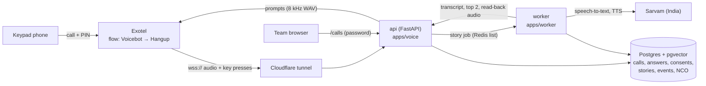
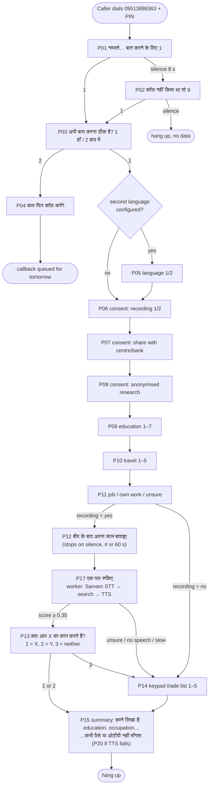

# HunarVaani: project handoff (status, plan, how it works)

Last updated: 29 Sep 2026, after the code review fixes (commits `a22910d`–`cb3b546`), starting
Step 11.
Read this first if you are a new teammate or a new Claude chat picking up the work.

---

## 1. What HunarVaani is, in simple words

A person in a village with a basic keypad phone calls our number. A friendly Hindi voice asks a
few questions: they answer by **pressing keys**, and for "what work do you do?" they **just talk**.
The system writes down their education, how far they can travel, whether they want a job or
their own work, and **works out their occupation from what they said** (for example "मैं सिलाई का
काम करती हूं" → Tailor, NCO 7531). It reads its guess back ("क्या आप दर्ज़ी का काम करते हैं?"),
the caller confirms with a key, and the call ends with a spoken summary and a safety line
("हुनरवाणी कभी पैसे या ओटीपी नहीं माँगता"). The team sees every call on a password-protected web page.

Later (Stage 2, not built yet) the system uses this profile to recommend NSQF training and jobs
near the caller and calls them back with a plan.

It was designed for Smart India Hackathon by **Team Cognify** (IIIT Vadodara). The full design is
"HunarVaani — Prototype Build Guide (File 3 of 3)"; this repo implements its **48-hour slice**
(section 11 of that guide), adapted to Exotel.

---

## 2. Where everything is

| What | Where |
|---|---|
| Code (this repo) | https://github.com/sakshamagrawalcode-cpu/hunarvaani (private, branch `main`) |
| Code on the laptop | `C:\Projects\hunarvaani` (Windows 11, Docker Desktop, VS Code) |
| Design doc (File 3 of 3) | Claude Docs page "HunarVaani — Prototype Build Guide (File 3 of 3)" |
| SkillCall (teammate idea, earlier prototype) | https://github.com/sakshamagrawalcode-cpu/SIH (React + FastAPI; `telephony/` has the first Exotel bridge; `backend/app/engine.py` has recommendation / skill-gap logic to reuse in Stage 2) |
| Satyavaani (teammate: voice-clone detector) | https://github.com/asmit-1101/satyavaani (FastAPI `/v1/score`; planned as the "liveness" flag in Stage 2) |
| Telephony (in use) | **Exotel trial**: flow **"sih idea"**, App ID **1349182**, shared trial number **09513886363** (callers must enter the account PIN first; PIN is in the Exotel dashboard) |
| Telephony (backup) | Plivo: signup blocked ("email domain not allowed"); a Contact-Sales request was sent. Plivo code is kept (`TELEPHONY_PROVIDER=plivo`) |
| Speech | Sarvam: Saaras v3 (speech-to-text), Bulbul v3 (text-to-speech). Key in `.env` |
| Domain | `hunarvaani.co.in` (DomainIndia, DNS on Cloudflare). Email `saksham@hunarvaani.co.in` forwards to Gmail via Cloudflare Email Routing |
| Public URL (dev) | Cloudflare quick tunnel (`https://<random>.trycloudflare.com`), **changes on every restart** |

**Secrets live only in `.env` on the laptop** (never in git, never in chat): `SARVAM_API_KEY`,
`PHONE_HASH_SECRET`, `PHONE_ENC_KEY`, `EXOTEL_WS_TOKEN`, `CALLS_PAGE_PASSWORD`, and
`EXOTEL_SID / EXOTEL_API_KEY / EXOTEL_API_TOKEN / EXOTEL_CALLER_ID / EXOTEL_APP_ID` (filled; the
worker logs "placing callbacks via exotel").
`scripts/gen_secrets.py` fills the generated ones.

---

## 3. What runs, and how the pieces talk



Docker Compose services (`infra/docker-compose.yml`): `api`, `worker`, `db` (Postgres 16 +
pgvector), `redis`, and `tunnel` (optional profile).

| Folder / file | Job |
|---|---|
| `core/dialogue/flow.py` | **The interview** as a pure state machine (no I/O). Provider-neutral |
| `core/dialogue/prompts.py` | The 20 Hindi prompts P01–P20 (P13, P15 are filled in during the call) |
| `apps/voice/exotel.py` | Exotel Voicebot WebSocket: plays prompts, reads keys, records the story |
| `apps/voice/main.py` | Routes: `/health`, `/ready`, `/audio/..`, `/exotel/ws/<token>`, `/exotel/status/<token>`, `/pv/*` (Plivo), `/calls` |
| `apps/voice/calls_page.py` | The team's calls page |
| `apps/worker/main.py` | Background worker: story understanding + callbacks |
| `core/stt.py`, `core/tts.py`, `core/dynprompt.py` | Sarvam speech-to-text / text-to-speech, cached dynamic prompts |
| `core/search/*` | Occupation search: aliases + BM25 + multilingual-e5 cosine |
| `core/interview_store.py`, `core/store.py` | Database writes |
| `core/callbacks.py`, `core/dialers.py` | Missed-call → callback queue, Exotel / Plivo dialers |
| `data/nco_seed.csv` | 16 occupations with Hindi and romanised aliases |
| `db/*.sql` | Schema (applied by `scripts/init_db.py`) |
| `scripts/` | `gen_secrets`, `render_prompts`, `seed_nco`, `set_public_url`, `simulate_call`, `show_call`, `calibrate_search`, `exotel_call_me`, `init_db` |
| `tests/` | 155 tests (unit + real-Postgres/Redis integration) |

---

## 4. How a call goes (the conversation flow)



**Anywhere in a menu:** `9` = delete all my data + block my number (P18, hang up);
`0` = flag the call for a human officer (P19) and repeat the question.
**No key or a wrong key:** P16 "जवाब नहीं मिला। फिर से सुनिए।" + the question once more, then the
question is recorded as `skipped` and the call moves on. A skipped consent counts as **no**.

### Example 1: Sunita, tailor (full happy path)

| # | Phone says | Sunita does | System does |
|---|---|---|---|
| 1 | P01 नमस्ते, हुनरवाणी से कॉल है… | presses 1 | logs key |
| 2 | P03 अभी बात करना ठीक है? | 1 | |
| 3 | P06 recording consent | 1 | consent row: recording = yes |
| 4 | P07 share consent | 1 | share = yes |
| 5 | P08 research consent | 2 | research = no |
| 6 | P09 education | 3 | `q_education = upto_8th` |
| 7 | P10 travel | 2 | `q_travel = 10km` |
| 8 | P11 job or own work | 2 | `q_lean = own_work` |
| 9 | P12 + beep | "मैं घर पर ब्लाउज़ और सूट सिलती हूं, दस साल से" and stops talking | recording stops 2.5 s after she goes quiet; saved as WAV |
| 10 | P17 एक पल रुकिए | waits ~1 s | worker: transcript → search: 7531 दर्ज़ी (0.8), 7411 (0.04) → renders P13 |
| 11 | P13 क्या आप दर्ज़ी का काम करते हैं? … | presses 1 | `occupation = 7531`, story.confirmed = 7531, labelled pair stored |
| 12 | P15 धन्यवाद। हमने लिखा है: आठवीं तक पढ़ाई, दर्ज़ी। … कभी पैसे या ओटीपी नहीं माँगता। | | call `completed`, duration stored |

On `/calls`: time, `xxxxxx1234`, up to 8th / up to 10 km / own work, her words, top 2
"7531 दर्ज़ी / 7411 …", occupation "7531 दर्ज़ी (read-back)", STT and search times, consents.

### Example 2: Ramesh, careful caller (timeouts, human flag, no recording)

1. P01: he waits (8 s). P02 plays. He presses 1.
2. P03: 1. P06 (recording): **2 = no** → keypad-only mode, no story will be recorded.
3. P07: 2, P08: 2.
4. P09: he presses **0** → P19 "एक अधिकारी आपसे जल्दी बात करेंगे" + P09 again; call flagged `human`.
   He presses 6 (ITI / diploma).
5. P10: silence → P16 + P10 again → silence → `q_travel = skipped`.
6. P11: 1 (job). Recording was refused, so P12 is skipped → P14 trade list → 3 (बिजली का काम, 7411).
7. P15: "…हमने लिखा है: आईटीआई या डिप्लोमा, बिजली मिस्त्री…". On `/calls` the row shows the red
   flags **human, keypad only**, travel "skipped".

### Example 3: short endings

- **Not now:** P03 → 2 → P04 "कल फिर कॉल करेंगे". A new callback row is queued for the same time
  tomorrow (moved out of 21:00–09:00 quiet hours).
- **Delete me:** any menu → 9 → P18. Every call row for that number is deleted, the number's hash
  goes on the block list, and it will never be called back. Their story recordings (WAV files)
  are deleted too.
- **Unclear story:** "मैं पढ़ाई करता हूँ" (real test call): best score 0.05 < 0.35 → P14 trade list,
  no wrong guess is read out.

---

## 5. What is built (Steps 1–10) and measured

| Step | Built | Commit |
|---|---|---|
| 1 | Laptop setup (Docker, WSL 2, Python 3.11, ffmpeg), repo | `30c02e3` |
| 2 | Sarvam key; domain + email; Plivo blocked → Exotel chosen | — |
| 3 | Docker stack: api, worker, Postgres/pgvector, Redis; `/health`, `/ready` | `e77ad02` |
| 4 | DB schema; 16 NCO occupations with e5 embeddings | `5089582` |
| 5 | 20 Hindi prompts rendered with Bulbul (8 kHz); `/audio` route | `b44dd68` |
| 6 | Cloudflare tunnel + `set_public_url.py` | `cb25ae5` |
| 7 | Missed call → free callback (rules: Indian mobiles, 3/day, budget, quiet hours, block list, dedupe, hashed + encrypted numbers) | `45fb299` |
| 8 | Keypad interview engine + Exotel Voicebot adapter + simulator | `4cfd752` |
| 8b | Recording stops on silence; per-call logs; `show_call.py` | `49d145a`, `c9f3af8` |
| 9 | Story → Sarvam STT → occupation search → spoken read-back (P13) | `ff5e1d6`, `279c8d2` |
| 10 | Spoken summary (P15/P20); `/calls` page | `1c092b7` |
| Review | 9 also deletes recordings; slow stories keep their transcript (worker saves it); "नई" no longer read back as नाई; callback matched by number if Exotel's call id differs; no shared "unknown" hash | `a22910d` |
| Review | `init_db.py` safe to re-run again (it failed on every re-run since Step 8) | `d393857` |
| Review | Simulator speaks in real time after the beep (simulated stories used to be dropped), skips P17 | `cb3b546` |

**Measured so far:**
- Real Exotel calls: prompts play, keys work, story recorded.
- Real call understanding: STT 550 ms, search 336 ms, **1.0 s total wait** (target ≤ 6 s).
- Search: all 24 test sentences right (19 describing work across the 16 occupations, incl. romanised; 5 with no occupation correctly refused, incl. "मैंने नई नौकरी शुरू की है").
- Real e5 cosines: correct ≈ 0.82–0.84, others ≈ 0.78–0.80, junk ≈ 0.74–0.78 → band 0.78–0.90 kept.
- 155 automated tests pass.

---

## 6. What is left in the 48-hour slice

### Step 11: the "Done when" checklist (from the guide)

| Check | Status |
|---|---|
| Missed call → callback within 30 s, caller not charged | ⏳ Needs a dedicated ExoPhone (trial asks for a PIN, the call is answered). Callback API: keys are filled; run `python scripts\exotel_call_me.py <number>` and check the `answered` event's `matched_by` (`call_id` or `number`) with `show_call.py` |
| Silence at opening → P02; 9 blocks; blocked number gets no callback | ✅ code + tests; ⏳ confirm on a real call |
| Language, consents, answers saved with keys and timestamps | ✅ (real calls) |
| No to recording → keypad trade list | ✅ tests; ⏳ real call |
| 45 s story → transcribed and read back within ~6 s | ✅ 1.0 s on a short story; ⏳ try a 45 s one |
| 3 at read-back → trade list | ✅ tests |
| Spoken summary; calls page shows answers, transcript, occupation, timings | ✅ built; ⏳ confirm on a real call |
| 4th missed call in a day → no callback; no callbacks in quiet hours | ✅ tests (needs callbacks live) |
| Bad signature → 403 | ✅ Plivo signatures; Exotel uses a secret URL token (wrong token → refused) |
| `scripts/measure.py` → WER, latency, callback time for 30 calls | ❌ Step 13 |

### Step 12: deploy to a server in India
One 4 vCPU / 8 GB VM in an Indian region (any cloud's Mumbai or Hyderabad region), Docker
Compose, Caddy for HTTPS, `api.hunarvaani.co.in` pointing at it (DNS in Cloudflare). This ends the
changing tunnel URL; real callers must only be served from this VM (guide's rule).

### Step 13: measure 30 calls
15 Hindi + 15 second-language calls with consenting teammates and family, a reference transcript
for each, then `scripts/measure.py` (to write): WER per language (jiwer), turn latency
(end of story → first read-back audio) p50/p90, callback time, completion rate →
`docs/measurements.md` (numbers for slide 3).

### Step 14: video, repo, slides (File 2)
2-minute screen recording of a call beside `/calls`; README, honesty table, requirement-to-file map;
slides.

### Open decisions and loose ends
- **Second language**: not chosen yet (P05 needs its line; prompts need rendering in it).
- **Dedicated ExoPhone + KYC**: needed for a true free missed call and for the pilot.
- **Plivo**: waiting on Contact-Sales reply (backup only).
- **NCO codes**: check each of the 16 against NCO-2015 Vol II before the demo.
- **Prompts**: a native speaker should check the Hindi; voice is Sarvam's default
  (set `SARVAM_SPEAKER`, then `render_prompts.py --force`).
- Plivo `/pv/ivr/start` still plays only P01 (the interview runs on Exotel).

---

## 7. Recommendations: how HunarVaani will suggest training and jobs (not built yet)

The 48-hour slice stops at a confirmed profile and says "आगे की जानकारी के लिए हम आपको फिर कॉल करेंगे".
The recommender is Stage 2 (the guide's 8-week build). The planned logic:

1. **Profile** from the call: education level, travel limit, job vs own work, confirmed NCO code,
   consents, district (from the number or a later question).
2. **Map occupation → NSQF qualifications**: NCO code → qualification packs (QP code, NSQF level,
   entry requirements, hours) from the guide's data pack (`qualification` table).
3. **Filter** by eligibility (education, age) and **reach** (training centres within the travel
   limit; hostel if chosen); rank with rules first, LightGBM later.
4. **Lean**: "job" → wage-employment trades and placements; "own work" → upskilling + schemes /
   loans (e.g. PMEGP, Mudra) with the "money rules".
5. **Plan**: 2–3 options with duration, cost, distance, next step.
6. **Deliver**: a follow-up call (our voice, P-prompts + TTS) reading the options, keypad to
   choose; later SMS / WhatsApp once DLT registration exists.
7. **Follow-up and integrity**: outcome calls at months 1/3/6, Satyavaani liveness flag, fraud
   personas.

Reuse: SkillCall's `backend/app/engine.py` already has occupation matching, skill-gap,
recommendations, career path and "SATYA" verification over demo CSVs; port its logic onto this
database in Stage 2. No foreign LLM may see real callers' data (Sarvam 105B, India-hosted, is the
planned LLM).

---

## 8. Everyday commands (Windows PowerShell, in `C:\Projects\hunarvaani`)

```powershell
# start (Docker Desktop must say "Engine running")
git pull
docker compose -f infra/docker-compose.yml --profile tunnel up -d --build
python scripts\set_public_url.py --from-tunnel      # then paste the wss:// URL into Exotel's Voicebot and Save
docker compose -f infra/docker-compose.yml up -d api worker

# after pulling new prompts or occupations
python scripts\render_prompts.py
docker compose -f infra/docker-compose.yml run --rm worker python scripts/init_db.py
docker compose -f infra/docker-compose.yml run --rm worker python scripts/seed_nco.py

# watch and inspect
docker compose -f infra/docker-compose.yml logs -f api worker
docker compose -f infra/docker-compose.yml exec api python scripts/show_call.py -n 3
docker compose -f infra/docker-compose.yml exec api python scripts/simulate_call.py   # no phone needed
docker compose -f infra/docker-compose.yml exec worker python scripts/calibrate_search.py
# team page: http://localhost:8000/calls  (user admin, password = CALLS_PAGE_PASSWORD)
```

Troubleshooting: "failed to connect to the docker API" → start Docker Desktop. No logs during a
call → tunnel URL changed; re-run `set_public_url.py` and update Exotel. `show_call.py` not found →
`up -d --build`. Simulator: answer within 8 s; at P12 give seconds to "speak" (a tone, so the
story has no words and the trade list follows).

---

## 9. Rules for anyone (human or Claude) changing this code

- Real callers' audio and text go only to Sarvam (India) and our own server. **No foreign LLM or
  speech API on real data.**
- No caste question, no Aadhaar. Consent before any question; 9 deletes the caller's data.
- Secrets only in `.env`; never print, log or commit them. Logs show only the last four digits.
- Callbacks only to Indian mobiles, ≤ 3 triggers per number per day, never 21:00–09:00 IST.
- The interview logic stays in `core/dialogue/flow.py` (pure, provider-neutral); providers are
  adapters.
- Workflow: Claude (cloud session) edits, runs lint + all tests, commits to `main`, pushes; the
  laptop runs `git pull` + `docker compose … up -d --build`. Tests:
  `pip install -r requirements-dev.txt`, then `pytest` (set `TEST_DATABASE_URL` and
  `TEST_REDIS_URL` to a throwaway Postgres with pgvector and Redis to run the integration tests;
  they wipe that database).
- Suggested models: Sonnet (medium) for setup and guidance; Opus (high) for call-flow, search and
  deployment code.
