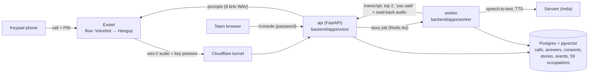
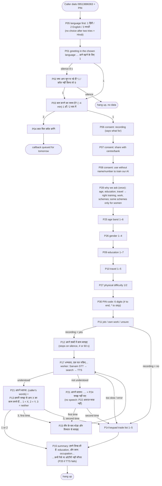

# HunarVaani: project handoff (status, plan, how it works)

Last updated: 29 Sep 2026, after the consent review (P06–P08) and the frontend / backend /
database layout. A short start file for a new chat is `CLAUDE.md` in the repo root.
Read this first if you are a new teammate or a new Claude chat picking up the work.
- The SIH problem statement and what we cover of it: `docs/PROBLEM_STATEMENT.md`.
- **The plan, in order, with a timeline: section 6.** Tick items there as they are finished.

**Rules for the work itself:** only one Claude chat changes the code at a time; always
`git pull` first; **update this file (section 5 and section 6) after finishing anything.**

---

## 1. What HunarVaani is, in simple words

A person in a village with a basic keypad phone calls our number. A polite voice greets them and
asks which language they want (**Hindi, English or Marathi**). They answer most questions by
**pressing keys** (consent, age, gender, education, how far they can travel, any physical
difficulty, job or own work), and for "what work do you do?" they **just talk**. The system
**works out their occupation from what they said** (one of 59, e.g. "मैं सिलाई का काम करती हूं" →
Tailor, NCO 7531), says back what it heard and what it understood, and the caller confirms with a
key. If it did not understand, the caller can tell it once more in more detail. The call ends with
a spoken summary and a safety line ("हुनरवाणी कभी पैसे या ओटीपी नहीं माँगता").

The team watches every call on the **team console** (a web app): profile, the caller's words and
recording, what the system understood, consents and a timeline of every step.

**Next (the heart of the problem statement):** use this profile to recommend 2–3 **NSQF training
courses and livelihood options near the caller**, with the skill gap, and say them on the call.

Designed for Smart India Hackathon (problem statement 26097, MoSJE, PM-AJAY) by **Team Cognify**
(IIIT Vadodara). The original design is "HunarVaani — Prototype Build Guide (File 3 of 3)"; this
repo started as its 48-hour slice, adapted to Exotel, and is now being extended as planned in
section 6.

---

## 2. Where everything is

| What | Where |
|---|---|
| Code (this repo) | https://github.com/sakshamagrawalcode-cpu/hunarvaani (private, branch `main`) |
| Code on the laptop | `C:\Projects\hunarvaani` (Windows 11, Docker Desktop, VS Code) |
| Team console | `http://localhost:5000/console/` on the laptop (user `admin`, password = `CALLS_PAGE_PASSWORD`); the older one-table page is `/calls` |
| Design doc (File 3 of 3) | Claude Docs page "HunarVaani — Prototype Build Guide (File 3 of 3)" |
| Problem statement | `docs/PROBLEM_STATEMENT.md` (SIH 26097) |
| SkillCall (teammate idea, earlier prototype) | https://github.com/sakshamagrawalcode-cpu/SIH (React + FastAPI; `backend/app/engine.py` has recommendation / skill-gap logic to port in step A9) |
| Satyavaani (teammate: voice-clone detector) | https://github.com/asmit-1101/satyavaani (FastAPI `/v1/score`; later "liveness" flag, B8) |
| Telephony (in use) | **Exotel trial**: flow **"sih idea"**, App ID **1349182**, shared trial number **09513886363** (callers enter the account PIN first) |
| Telephony limits | Outbound calls (callbacks) need **business KYC** → blocked for us (HTTP 403). Inbound calls work |
| Telephony (backup) | Plivo: signup blocked; Contact-Sales request sent. Plivo code kept (`TELEPHONY_PROVIDER=plivo`) |
| Speech | Sarvam (India): Saaras v3 speech-to-text, Bulbul v3 text-to-speech. Key in `.env` |
| Domain | `hunarvaani.co.in` (DomainIndia, DNS on Cloudflare); email forwarding via Cloudflare |
| Public URL (dev) | Cloudflare quick tunnel, **changes on every restart** |

**Secrets live only in `.env` on the laptop** (never in git, never in chat): `SARVAM_API_KEY`,
`PHONE_HASH_SECRET`, `PHONE_ENC_KEY`, `EXOTEL_WS_TOKEN`, `CALLS_PAGE_PASSWORD`,
`EXOTEL_SID / EXOTEL_API_KEY / EXOTEL_API_TOKEN / EXOTEL_CALLER_ID / EXOTEL_APP_ID`.
`scripts/gen_secrets.py` fills the generated ones. Other settings: `LANGUAGES=hi-IN,en-IN,mr-IN`,
`STORY_WAIT_SECONDS=8`.

---

## 3. What runs, and how the pieces talk



Docker Compose services (`infra/docker-compose.yml`): `api` (also serves the console, built in a
Node stage of the Dockerfile), `worker`, `db` (Postgres 16 + pgvector), `redis`, `tunnel`
(optional profile).

**Folders:** `frontend/` (team console) · `backend/` (voice API, worker, shared logic, tests) ·
`database/` (schema, seed data, sample data) · `scripts/` (tools you run) · `audio/` (rendered
prompts, not in git) · `infra/` (Docker) · `docs/`. Each of `frontend/`, `backend/`, `database/`
has its own README.

| Folder / file | Job |
|---|---|
| `backend/core/dialogue/flow.py` | **The interview** as a pure state machine (no I/O). Provider-neutral |
| `backend/core/dialogue/prompts.py` | 28 prompts × 3 languages (P13, P15, P21 are filled in during the call) |
| `backend/core/dialogue/summary.py` | The closing summary text in each language |
| `backend/apps/voice/exotel.py` | Exotel Voicebot WebSocket: plays prompts, reads keys, records the story |
| `backend/apps/voice/main.py` | Routes: `/health`, `/ready`, `/audio/..`, `/exotel/ws/<token>`, `/exotel/status/<token>`, `/pv/*` (Plivo), `/calls`, `/console/…` |
| `backend/apps/voice/console_api.py` | Read-only JSON for the console (`/console/api/summary`, `/calls`, `/calls/<id>`, `/calls/<id>/audio/<n>`, `/people`, `/occupations`) |
| `backend/apps/voice/calls_page.py` | The older one-table calls page |
| `backend/apps/worker/main.py` | Background worker: story understanding + callbacks |
| `backend/core/stt.py`, `tts.py`, `dynprompt.py` | Sarvam speech-to-text / text-to-speech, cached generated prompts |
| `backend/core/story_job.py` | Worker job: transcribe → search → render "you said" + read-back (in parallel) |
| `backend/core/search/*` | Occupation search: aliases + BM25 + multilingual-e5 meaning match |
| `backend/core/geo.py` | PIN code → district (first 3 digits, sample table) |
| `backend/core/interview_store.py`, `store.py` | Database writes (incl. 9 = delete everything, recordings too) |
| `backend/core/callbacks.py`, `dialers.py` | Missed-call → callback queue, Exotel / Plivo dialers |
| `backend/tests/` | 277 tests (unit + real-Postgres/Redis integration) |
| `frontend/` | **Team console**: Vite + React + TypeScript + Tailwind; pages in `src/pages/` |
| `database/schema/*.sql` | Tables (applied by `scripts/init_db.py`) |
| `database/seed/nco_seed.csv` | **59 occupations** with English, Hindi, Marathi names and words callers use |
| `database/sample/` | Sample data: `pin_districts.csv` (A7), recommendation data (A8) |
| `scripts/` | `gen_secrets`, `render_prompts`, `seed_nco`, `set_public_url`, `simulate_call`, `show_call`, `calibrate_search`, `exotel_call_me`, `init_db` |

---

## 4. How a call goes (the conversation flow)



**PIN code (P30):** the caller types the 6 digits (they end by themselves; `#` ends early, `*` skips). Too short or wrong → P31 and once more, then skipped. The first 3 digits give the district from `database/sample/pin_districts.csv` (approximate sample table); saved as answers `q_pin` and `q_district`. While typing the PIN, 9 and 0 are ordinary digits (they do not delete or flag).

**Anywhere in a menu (except while typing the PIN):** `9` = delete all my data (calls, answers, recordings) + block my number
(P18, hang up); `0` = flag the call for a human officer (P19) and repeat the question.
**No key:** P16 "माफ़ कीजिए, हमें आपका जवाब नहीं मिला…"; **wrong key:** P29 "माफ़ कीजिए, यह बटन इस सवाल
के लिए नहीं है…"; then the question once more, then it is recorded as `skipped` and the call moves
on. A skipped consent counts as **no**.

After step A10 (section 6), P15 will be followed by the recommendations: "आपके लिए दो रास्ते हैं: …"
with 1/2 to choose.

### Example 1: Sunita, tailor, Hindi (full happy path)

| # | Phone says | Sunita does | System does |
|---|---|---|---|
| 1 | P05 language menu | 1 (Hindi) | `call.language = hi-IN` |
| 2 | P01 नमस्ते जी! … (in Hindi) | presses 1 | logs key |
| 3 | P03 बात करने का समय है? | 1 | |
| 4 | P06, P07, P08 consents | 1, 1, 2 | recording yes, share yes, research no |
| 5 | P28 (why we ask, once) + P25 age, P26 gender | 3, 1 | `26_35`, `female` |
| 6 | P09, P10, P27, P11 | 3, 2, 1, 2 | up to 8th, 10 km, no difficulty, own work |
| 7 | P12 + beep | "मैं घर पर ब्लाउज़ और सूट सिलती हूं, दस साल से" | recording stops 2.5 s after she goes quiet |
| 8 | P17 धन्यवाद, एक पल रुकिए… | waits ~2–4 s | worker: transcript → 7531 दर्ज़ी (0.8) / 7533 कढ़ाई → renders two audio pieces at once |
| 9 | "आपने बताया: मैं घर पर ब्लाउज़ और सूट सिलती हूं, दस साल से। हमारी समझ से, आप दर्ज़ी का काम करते हैं। …" | presses 1 | `occupation = 7531`, story confirmed |
| 10 | P15 summary … | | call `completed`; the "you said" audio is deleted |

On the console: her row on Overview and Calls; the call page shows her profile, her words with the
recording, "Understood: Tailor (दर्ज़ी) / Embroidery worker", "Caller confirmed: yes", consents and
the full timeline.

### Example 2: Ramesh, careful caller (timeouts, human flag, no recording)

1. P01: he waits 8 s → P02 → presses 1. P05: 1 (Hindi). P03: 1.
2. P06 (recording): **2 = no** → keypad-only mode, no story will be recorded. P07: 2, P08: 2.
3. P25: he presses **0** → P19 "हमारे एक अधिकारी जल्दी ही आपसे बात करेंगे…" + P25 again; call
   flagged `wants a human`. He presses 4 (36–45). P26: 2.
4. P09: 6 (ITI). P10: silence → P16 + P10 again → silence → `q_travel = skipped`. P27: 2, P11: 1.
5. Recording was refused → P14 trade list → 3 (electrical work, 7411) → P15.
   On the console: badges **wants a human**, **keypad only**; travel "Skipped".

### Example 3: Meena, Marathi, not understood the first time

P05: 3 (Marathi) → all questions in Marathi → story: "आज हवामान चांगलं आहे" (small talk) →
"तुम्ही सांगितलं: आज हवामान चांगलं आहे. माफ करा, आम्हाला तुमचं काम नीट समजलं नाही." + P23 →
she tells again: "मी शेतात मजुरी करते" → "…तुम्ही शेतमजूर म्हणून काम करता…" → 1 → summary in Marathi.
The console shows both tries.

### Example 4: short endings

- **Not now:** P03 → 2 → P04. A callback is queued for tomorrow (needs KYC to actually dial).
- **Delete me:** any menu → 9 → P18. Every call row for that number, its recordings and cached
  results are deleted; the number's hash is blocked.

---

## 5. What is built, and measured

| Step | Built | Commit |
|---|---|---|
| 1 | Laptop setup (Docker, WSL 2, Python 3.11, ffmpeg), repo | `30c02e3` |
| 2 | Sarvam key; domain + email; Plivo blocked → Exotel chosen | — |
| 3 | Docker stack: api, worker, Postgres/pgvector, Redis; `/health`, `/ready` | `e77ad02` |
| 4 | DB schema; NCO occupations with e5 embeddings | `5089582` |
| 5 | Hindi prompts rendered with Bulbul (8 kHz); `/audio` route | `b44dd68` |
| 6 | Cloudflare tunnel + `set_public_url.py` | `cb25ae5` |
| 7 | Missed call → free callback (rules: Indian mobiles, 3/day, budget, quiet hours, block list, dedupe, hashed + encrypted numbers). **Blocked by Exotel KYC** | `45fb299` |
| 8 | Keypad interview engine + Exotel Voicebot adapter + simulator | `4cfd752` |
| 8b | Recording stops on silence; per-call logs; `show_call.py` | `49d145a`, `c9f3af8` |
| 9 | Story → Sarvam STT → occupation search → spoken read-back | `ff5e1d6`, `279c8d2` |
| 10 | Spoken summary; `/calls` page | `1c092b7` |
| Review | 9 deletes recordings too; late transcripts kept; callback matched by number; `init_db.py` re-runnable; simulator fixed | `a22910d`–`cb3b546` |
| Fix | Calls no longer drop after the story when the worker needs over 3 s | `3652ddf` |
| A1 | **Three languages** (Hindi, English, Marathi), menu right after the greeting | `32890f5` |
| A2 | **Read-back says what we heard**; unclear or "neither" → tell it again in more detail; all prompts polite and clear; "you said" audio deleted after the call | `4e15b34` |
| A3 | **Age, gender, physical difficulty** questions; each question says **why** we ask | `c588c06` |
| A4 | **59 occupations** (was 16) incl. traditional crafts and rural work, words in 3 languages | `710657e` |
| A5 | **Team console** (React): overview, calls, call detail with recording + timeline, people, occupations | `44dd869` |
| A3b | "Why we ask" said **once** (P28) before the personal questions; the questions are short again | `bd15a36` |
| Layout | Code split into `frontend/`, `backend/`, `database/` (+ `scripts/`, `audio/`, `infra/`, `docs/`), a README in each | `4517c32` |
| B2 | **Live call view** (done early; redesigned: sidebar layout, three panels Conversation / Processing / Errors & warnings, no English shown in the console); language menu now comes **before** the greeting; wrong key gets its own apology (P29): every step saved as an event (what the system said with English, keys, answers, the caller's words + English translation via Sarvam translate, occupation scores, worker timings, problems); the call page shows a categorised live log (filters, search, follow live), LIVE badges and a "call happening now" banner | see git log |
| A7 | **District from the PIN code**: P30/P31 in 3 languages, digit-collecting `Ask.digits` + `Interview.on_digits`, `core/geo.py` + `database/sample/pin_districts.csv` (Maharashtra + Hindi-belt, 3-digit prefixes), console shows District | see git log |
| Review | Consents in simple words: P06 only about recording (and "no" still works with keys), P07 says why we share, P08 = "use without name and number to train our AI and recommendation models"; console shows readable consent names; `CLAUDE.md` start file | see git log |

**Measured so far:**
- Real Exotel calls: prompts play, keys work, story recorded, read-back and summary heard.
- Real call understanding: STT 540–700 ms, search 60–340 ms; with the read-back audio 1–4 s.
- Search: 58 test sentences across the 59 occupations in 3 languages map correctly (plus the
  earlier 19 Hindi, 12 English/Marathi); names, small talk and "I am studying" are refused.
- Real e5 cosines (16-occupation set): correct ≈ 0.82–0.84, others ≈ 0.78–0.80, junk ≈ 0.74–0.78.
- 277 automated tests pass (1 skipped where ffmpeg is missing).

---

## 6. The plan (step by step, with a timeline)

**Principle:** first finish a complete, working prototype with the important, doable parts; the
big features come after, in priority order, only if time remains.

**What the finished prototype does (Phase A):** a caller rings, picks a language, answers the
questions by key and voice, the system understands their work, **finds the 2–3 best training /
livelihood options for them from our (sample) dataset of occupations, NSQF courses, centres and
schemes, explains the skill gap, and says the options on the call**; the team sees everything,
live, on the console.

### Phase A: finish the prototype (must have), about 8–9 working days

Days are working days of build + your test calls; a Claude session builds each step in a few
hours, the rest is testing on real calls.

| # | Step | What exactly | Who | Time | Status |
|---|---|---|---|---|---|
| A1 | Three languages | Hindi, English, Marathi | Claude | — | ✅ `32890f5` |
| A2 | Better read-back, polite prompts | "you said…", retell once, polite wording | Claude | — | ✅ `4e15b34` |
| A3 | Age, gender, physical difficulty; "why we ask" once (P28) | keypad questions P25–P27 | Claude | — | ✅ `c588c06`, `bd15a36` |
| A4 | 59 occupations | better matching of what callers say | Claude | — | ✅ `710657e` |
| A5 | Team console v1 | calls, call detail, people, occupations | Claude | — | ✅ `44dd869` |
| A6 | **Test A1–A5 on real calls** | prompts already rendered (needs Sarvam credits for calls), rebuild, 3 calls (one per language), check the console | You | 0.5 day | ⏳ next |
| A7 | **Where the caller lives** | keypad PIN code (6 digits + #) → district, from a PIN-prefix table for the demo state (Maharashtra) + a few Hindi-belt districts; spoken fallback "say your district" later | Claude | 0.5 day | ✅ (needs `render_prompts.py` for P30, P31) |
| A8 | **Sample dataset** (clearly labelled "sample, for demonstration") | `database/sample/`: for each of the 59 occupations: NSQF courses (QP code, name, NSQF level, hours, min education, age range, free/fee, scheme: PMKVY / DDU-GKY / PM-AJAY GIA), skills each course teaches (for the skill gap), heavy-work flag; training centres per district (distance, hostel yes/no, women-only batches); local demand per district (openings, typical wage); self-employment routes (tool kit, loan: PMEGP / Mudra / PM-AJAY GIA income generation) | Claude | 1 day | ☐ |
| A9 | **Recommendation engine** | score = occupation fit (same trade upskill or a near trade) + eligibility (age, education) + reach (centre within travel limit, or hostel) + wish (job → placement-linked; own work → entrepreneurship + loan) + physical (no heavy work if difficulty) + local demand; returns top 3 with plain-language reasons and the skill gap; port ideas from SkillCall `engine.py`; many tests | Claude | 1 day | ☐ |
| A10 | **Say the options on the call** | after P15: "आपके लिए दो अच्छे रास्ते हैं: 1) … 2) …; जानकारी चाहिए तो उसका नंबर दबाइए" → choice saved as "interested"; in all 3 languages | Claude | 0.5–1 day | ☐ |
| A11 | **Console v2** | recommendations + reasons + skill gap on the call and people pages; dataset pages (courses, centres, schemes); **English translation in brackets** of Hindi/Marathi words (Sarvam Translate); CSV export; district filter | Claude | 1 day | ☐ |
| A12 | Step 11 checklist on real calls | every row of the checklist below, fix what breaks | You + Claude | 0.5 day | ☐ |
| A13 | Deploy to India (Step 12) | 4 vCPU / 8 GB VM in Mumbai/Hyderabad, Docker Compose, Caddy HTTPS, `api.hunarvaani.co.in`; ends the changing tunnel URL | You + Claude | 0.5–1 day | ☐ |
| A14 | Measure 30 calls (Step 13) | 10 Hindi + 10 Marathi + 10 English with consenting people; `scripts/measure.py`: word error rate, wait time p50/p90, completion rate, correct occupation rate → `docs/measurements.md` | You + Claude | 1 day | ☐ |
| A15 | Video, README, slides (Step 14) | 2-minute recording of a call beside the console; honesty table (real vs sample data); slides | You + Claude | 1 day | ☐ |

**Suggested timeline:** Day 1: A6 + A7. Day 2: A8. Day 3: A9. Day 4: A10 + tests on calls.
Day 5: A11. Day 6: A12 + A13. Day 7: A14. Day 8: A15. Day 9: buffer.

### Phase B: add if time remains (in this order)

Ordered by value to the judges ÷ effort. Each is independent, so we can stop anywhere.

| # | Feature | Why it matters | Effort | Risk / blocker |
|---|---|---|---|---|
| B1 | **Traditional family occupation + "what would you like to learn?"** (two short spoken questions, same understanding pipeline) | the problem statement asks for both | 1 day | low |
| B2 | ✅ **Live call view** (done early, polling every 1.5 s): each prompt, key, words, understanding and timing, with English | — | — | done |
| B3 | **Speak or press for every answer** ("पच्चीस साल" → age band) | more natural for callers | 1.5 days | medium (speech errors) |
| B4 | More languages (e.g. Bengali, Tamil, Telugu, Gujarati) | reach | 0.5 day each | needs a native speaker check |
| B5 | Officer tools: mark follow-up done, notes, filters by district/occupation | the GIA "coordination" issue | 1 day | low |
| B6 | **"Talk like a person"**: India-hosted LLM (Sarvam) writes each next line from earlier answers and understands free answers; consent lines stay fixed | empathy, conversation | 2–3 days | high latency (3–5 s a turn), unpredictable wording |
| B7 | Follow-up call with the plan, and missed-call → free callback | the original design | 0.5 day | **blocked: Exotel business KYC** |
| B8 | Satyavaani liveness flag; fraud checks | integrity | 1 day | medium |
| B9 | WhatsApp voice-note channel (same pipeline) | problem statement mentions it | 2 days | WhatsApp Business API approval |
| B10 | Learned ranking (LightGBM) from outcomes | better recommendations | later | needs real outcome data |

### Not possible in this prototype
- Missed-call callbacks and follow-up calls: Exotel needs business KYC documents (we have none).
- Dialects Sarvam does not support (Bhojpuri, Marwari, …).
- Real PM-AJAY beneficiary / centre data: not public → sample data, clearly labelled.
- Asking caste for eligibility: our rule; eligibility is confirmed by an official afterwards.
- Actually enrolling people in a course.

### Step 11 checklist (from the guide; used in A12)

| Check | Status |
|---|---|
| Missed call → callback within 30 s, caller not charged | ⛔ blocked by Exotel KYC (HTTP 403 on the callback API); code + tests done |
| Silence at opening → P02; 9 blocks; blocked number gets no callback | ✅ code + tests; ⏳ confirm on a real call |
| Language, consents, answers saved with keys and timestamps | ✅ real calls; visible on the console |
| No to recording → keypad trade list | ✅ tests; ⏳ real call |
| 45 s story → transcribed and read back within ~6 s | ✅ 1–4 s on short stories; ⏳ try a 45 s one |
| 3 at read-back → tell again, then trade list | ✅ tests; ⏳ real call |
| Spoken summary; console shows answers, words, occupation, timings | ✅ built; ⏳ confirm on a real call |
| 4th missed call in a day → no callback; no callbacks in quiet hours | ✅ tests (needs callbacks live) |
| Wrong token → refused | ✅ Exotel secret URL token; Plivo signatures |
| `scripts/measure.py` → WER, latency for 30 calls | ☐ A14 |

### English translation: only when a model needs it
None of our models needs English today: the occupation search works on Hindi, Marathi and English
directly (word lists + multilingual meaning model), the recommender (A9) uses saved profile
values and codes, and Sarvam's LLM understands Indian languages. When an English-only model is
added (e.g. B10 learned ranking, or training on callers' words), set `TRANSLATE_TO_ENGLISH=true`:
the worker then saves an English copy of each story in `story.transcript_en` (Sarvam translate,
in parallel with the read-back voice, so callers do not wait). Training data may only use callers
who said yes to P08 (train our AI). The console never shows the translation.

### Review of what the call asks (29 Sep)
- **Questions are enough, not too many** (about 3–4 minutes): language, OK to talk, 3 consents,
  age, gender, education, travel, physical difficulty, job or own work, the work story. Still
  missing for good recommendations: **where the caller lives** (A7) and, from the problem
  statement, **family occupation and what they want to learn** (B1). No caste, no Aadhaar.
- **All 3 consents stay**: each purpose needs its own permission under India's data protection
  law (DPDP Act 2023), and each is short. Recording (P06) is needed for the spoken story; saying
  no still gets the keypad interview. Sharing (P07) is needed before a centre or bank may contact
  them. Training our AI (P08) is optional and does not change the help they get.
- "Why we ask" is said once (P28) before the personal questions; the questions are short.
- To check on real calls: that the Marathi and English sound natural (native speaker), and that
  the whole call stays under ~4 minutes.

### Open decisions and loose ends
- **Sarvam credits ran out** (HTTP 402 on 29 Sep). All 75 prompt files were rendered before that. Live calls need credits for speech-to-text and the read-back / summary voice: add credits in the Sarvam dashboard.
- **Demo state for the sample data (A7/A8)**: Maharashtra (fits Marathi) + 2–3 Hindi-belt districts
  unless the team prefers another.
- **Native-speaker check** of the Hindi, Marathi and English prompts; voice is Sarvam's default
  (set `SARVAM_SPEAKER`, then `render_prompts.py --force`).
- **NCO codes**: the 59 use NCO-2015 / ISCO-08 4-digit unit groups; check each against NCO-2015
  Vol II before the demo.
- **Plivo**: waiting on Contact-Sales reply (backup only). Plivo `/pv/ivr/start` plays only P01.

---

## 7. Recommendations: design for steps A7–A10

1. **Profile** from the call: language, age band, gender, education, travel limit, physical
   difficulty, job vs own work, confirmed occupation (NCO), district (A7), consents.
2. **Candidate options** for the occupation: (a) upskilling courses in the same trade (NSQF level
   above what they likely have), (b) courses in near trades (same sector), (c) for "own work":
   entrepreneurship course + tool kit + loan route.
3. **Filters**: age inside the course's range; education ≥ the course minimum; a centre within the
   travel limit (or hostel if they said hostel); heavy-work courses dropped if physical difficulty;
   women-only batches offered first to women who ask.
4. **Score** (rules first, weights in one place): occupation fit 0.35, local demand 0.20, reach
   0.20, wish (job/own work) 0.15, NSQF step-up 0.10. Ties → shorter, free courses first.
5. **Skill gap**: skills the course teaches minus what their occupation and story already show
   (e.g. tailor → "pattern cutting, machine embroidery, pricing").
6. **Say it**: top 2 on the call in the caller's language, with duration, distance, cost ("free")
   and one reason each; press 1/2 → "interested" saved. Top 3 with reasons on the console.
7. **Honesty**: every sample row carries `sample=true`; the console and slides say so.

Reuse: SkillCall's `backend/app/engine.py` (occupation matching, skill gap, recommendations,
career path). No foreign LLM may see real callers' data.

---

## 8. Everyday commands (Windows PowerShell, in `C:\Projects\hunarvaani`)

```powershell
# start (Docker Desktop must say "Engine running")
git pull
docker compose -f infra/docker-compose.yml --profile tunnel up -d --build
python scripts\set_public_url.py --from-tunnel      # then paste the wss:// URL into Exotel's Voicebot and Save
docker compose -f infra/docker-compose.yml up -d api worker

# after pulling new prompts or occupations
python scripts\render_prompts.py            # renders missing or changed prompts, every language
python scripts\render_prompts.py --force    # re-renders ALL (only if the voice changed; costs credits)
docker compose -f infra/docker-compose.yml run --rm worker python scripts/init_db.py
docker compose -f infra/docker-compose.yml run --rm worker python scripts/seed_nco.py

# watch and inspect
# team console: http://localhost:5000/console/  (user admin, password = CALLS_PAGE_PASSWORD)
docker compose -f infra/docker-compose.yml logs -f api worker
docker compose -f infra/docker-compose.yml exec api python scripts/show_call.py -n 3
docker compose -f infra/docker-compose.yml exec api python scripts/simulate_call.py   # no phone needed
docker compose -f infra/docker-compose.yml exec worker python scripts/calibrate_search.py
```

Troubleshooting: "failed to connect to the docker API" → start Docker Desktop. No logs during a
call → tunnel URL changed; re-run `set_public_url.py` and update Exotel. Console says "not built"
→ `up -d --build`. Console keeps asking for a password → check `CALLS_PAGE_PASSWORD` in `.env` and
restart the api. Simulator: answer within 8 s; at P12 give seconds to "speak" (a tone, so the story
has no words and the retell / trade list follows).

Console development (optional, needs Node 22): `cd frontend`, `npm install`, `npm run dev`,
open `http://localhost:5173/console/` while the api runs (laptop port 5000).

---

## 9. Rules for anyone (human or Claude) changing this code

- Real callers' audio and text go only to Sarvam (India) and our own server. **No foreign LLM or
  speech API on real data.**
- No caste question, no Aadhaar. Consent before any question; 9 deletes the caller's data.
- Secrets only in `.env`; never print, log or commit them. Logs and the console show only the
  last four digits.
- Callbacks only to Indian mobiles, ≤ 3 triggers per number per day, never 21:00–09:00 IST.
- The interview logic stays in `backend/core/dialogue/flow.py` (pure, provider-neutral); providers are
  adapters.
- Sample data is always labelled as sample.
- Workflow: one Claude chat at a time; `git pull` first; edit, run lint + all tests, commit to
  `main`, push; **update this file**. The laptop runs `git pull` + `docker compose … up -d --build`.
  Tests: `pip install -r backend/requirements-dev.txt`, then `pytest` (set `TEST_DATABASE_URL` and
  `TEST_REDIS_URL` to a throwaway Postgres with pgvector and Redis to run the integration tests;
  they wipe that database). Console: `npm run build` in `frontend/` must pass (strict TypeScript).
- Suggested models: Sonnet (medium) for setup and guidance; Opus (high) for call-flow, search,
  recommendation and deployment code.
